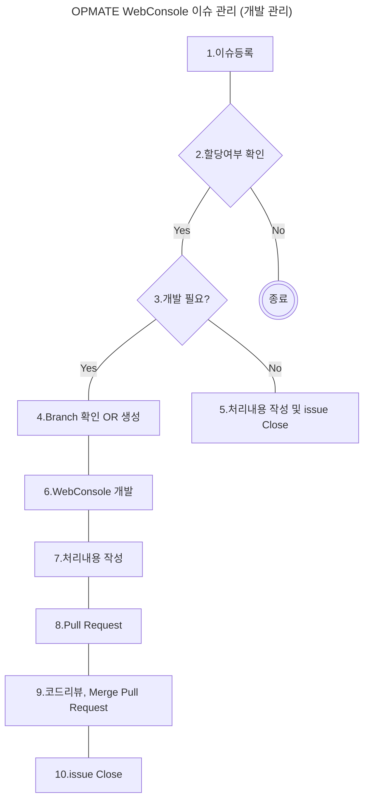

## 1. OPMATE WebConsole 개발 Process

### 1.이슈등록
#### 1) 이슈등록 예시

형식에 맞는 라벨 등록 필요
#### 2) 라벨

### 2.할당여부확인

### 3.개발필요?
사용상의 오류가 아닌 소스 개발이 필요할 경우 Assignee(개발담당자)가 소스 개발
### 4.Branch 확인 OR 생성
이슈 세부 내용 -> Development 에 개발을 위한 Branch 생성 여부를 확인, Branch 가 존재 하지 않을때는 생성
```
1. github repository 에서 로컬로 소스를 clone
1-1. Personal Access Tokens 활용
1-1-1. github -> [개인 계정] -> settings -> Developer Settings -> Personal Access Tokens
https://[gh 로 시작하는 Personal Access Tokens]@github.com/opmate/opme.git gigithub 에서 branch를 로컬디렉토리 clone
1-2.  Pycharm 등 IDE 의 git 기능 활용
1-2-1. Pycharm git 기능 에서 아이디/패스워드를 입력하고 https://github.com/opmate/opme.git gigithub 에서 branch를 로컬디렉토리 clone
2. 가상 환경 생성
2-1. clone 받은 디렉토리로 이동
2-2. [python 3.9 설치위치]\python.exe -m venv venv
2-3. venv/Scripts 디렉토리로 이동
2-4. activate.bat 실행
3. 가상 환경에서 패키지 다운로드
3-1. venv) 상태에서 clone 받은 디렉토리로 이동
3-2. pip install -r requirements.txt
4. Pycharm 개발환경 설정
4-1. pycharm 실행 file > open > [clone 받은 디렉토리] 선택
4-2. file > settings > Project : opme > Python Interpreter
   Add Interpreter 선택 (venv/Scripts/python.exe 선택)
4-3. RUN/DEBUG Configuration
4-3-1. 우측 상단 Current File -> Edit Configuration
4-3-2. Add new Configuration -> Python
4-3-3. Run -> Script : manage.py -> parameter : runserver 로 설정하면 됨
```
  
### 5.처리내용 작성 및 issue close
Comment 에 처리 내용을 작성하고 issue 를 Close 함
### 6.WebConsole 개발
로컬 개발 환경에서 WebConsole 개발
### 7.처리 내용 작성
Comment 에 처리 내용을 작성
### 8.Pull Request
개발 Branch -> main Branch 로 Pull Request 요청
### 9.코드리뷰, Merge Pull Request
개발된 코드를 리뷰하고 Merge Pull Request, Bracnch 삭제
### 10. issue Close
Comment 에 처리 내용을 작성하고 issue 를 Close 함

